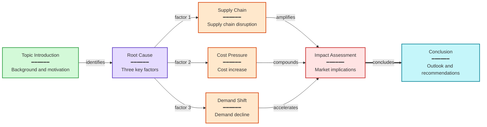
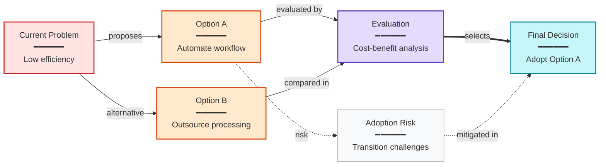

Based on the video summary below, create Mermaid flowcharts showing the narrative logic and key relationships.
Produce one diagram for each #### section in the summary that is suitable for visualization.

Output format:
Each diagram corresponds to a #### section in the summary. The diagram heading must exactly match a #### heading from the summary (including the #### prefix).
If a section is not suitable for a flowchart, you may skip it.
No blank line between the heading and ```mermaid.

Strict rules:
- First line must be graph with direction: graph LR (left-to-right) or graph TB (top-to-bottom), choose based on content structure
- Node text format: Title<br/>━━━━━━<br/>Detail description, use <br/>━━━━━━<br/> for line break
- Node format: UPPERCASE["Title<br/>━━━━━━<br/>Detail"], e.g. A["Introduction<br/>━━━━━━<br/>Explain the topic"]
- Connection types: A --> B (main flow), A -.-> B (supplementary/optional), A ==> B (emphasis)
- EVERY arrow MUST have a label explaining "why" or "how" nodes connect: A -->|causes| B. No bare arrows without labels. Examples: causation (leads to, causes), conditions (if success, if failure), method (via API), feedback (corrects). Keep labels to 2-6 words
- 5-12 nodes per diagram
- Choose topology based on content logic (branching, convergence, parallel paths, loops, etc.) — avoid making every diagram a simple linear chain
- If the content is a linear narrative with no natural branching, merge related steps into a single node (list with <br/>), increase per-node information density, and keep nodes to 3-6 to avoid long straight lines
- Wrap in ```mermaid and ```
- Output only diagram headings and Mermaid code blocks, no other explanation text
- Add style declarations at the end of each code block to color-code nodes by type

Syntax safety rules:
- Node text must be wrapped in double quotes: ["text"]
- Never use "number. space" pattern in node text (e.g. 1. Step), use "1.Step" or "Step 1:" instead
- No emoji in node text
- Avoid half-width quotes or parentheses in node text
- Keep title under 40 characters, detail under 150 characters per node (use <br/> to list when merging steps)

Color guide (choose by semantic role):
- Green fill:#d3f9d8,stroke:#2f9e44 — opening, input, start
- Red fill:#ffe3e3,stroke:#c92a2a — problem, decision, conflict
- Purple fill:#e5dbff,stroke:#5f3dc4 — analysis, reasoning, core argument
- Orange fill:#ffe8cc,stroke:#d9480f — action, method, tool
- Cyan fill:#c5f6fa,stroke:#0c8599 — result, conclusion, output
- Yellow fill:#fff4e6,stroke:#e67700 — data, memory, reference
- Gray fill:#f8f9fa,stroke:#868e96 — background, context, supplement

Example output:
#### Overall Narrative Flow


#### Solution Comparison and Decision


Summary:
{{summary}}