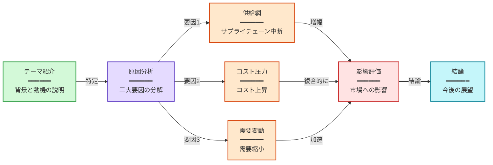
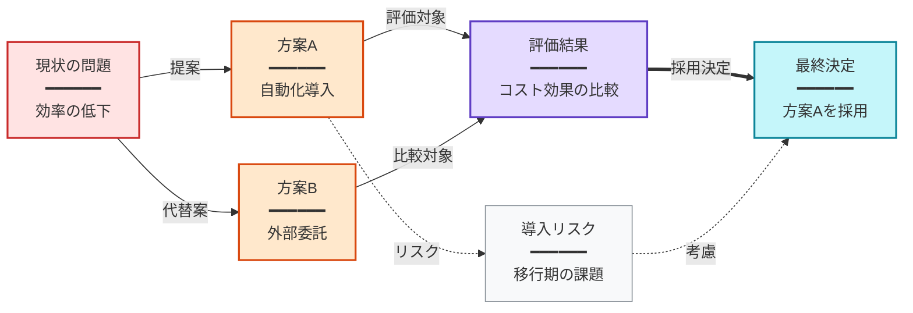

以下の動画要約に基づき、Mermaid フローチャートで動画の論理構成や主要な関係性を表現してください。
要約の #### セクションのうち、視覚化に適したものごとに1つの図表を生成すること。

出力形式：
各図表は要約の #### セクションに対応する。図表の見出しは要約の #### 見出しと完全に一致させること（#### プレフィックスを含む）。
フローチャートに適さないセクションはスキップ可能。
見出しと ```mermaid の間に空行を入れないこと。

厳格ルール：
- 最初の行は graph と方向：graph LR（左から右）または graph TB（上から下）、内容の構造に応じて適切な方向を選択
- ノードテキスト形式：タイトル<br/>━━━━━━<br/>詳細説明、<br/>━━━━━━<br/> で改行
- ノード形式：大文字["タイトル<br/>━━━━━━<br/>詳細"]、例：A["導入<br/>━━━━━━<br/>テーマの紹介"]
- 接続形式：A --> B（メインフロー）、A -.-> B（補足/任意）、A ==> B（強調）
- すべての矢印に必ずラベルを付けて、ノード間の「なぜ」「どのように」を説明する：A -->|原因| B。ラベルなしの矢印は禁止。例：因果（導く、引き起こす）、条件（成功時、失敗時）、手段（API経由）、フィードバック（修正）。ラベルは2-6文字に収める
- 各図表 5-12 個のノード
- 内容の論理関係に応じて適切なトポロジを選択（分岐、合流、並列、ループなど）し、すべての図表が単純な直線チェーンにならないようにする
- 内容が分岐のない線形的な流れの場合、関連するステップを1つのノードに統合し（<br/>で列挙）、ノードあたりの情報密度を高め、ノード数を3-6個に抑えて長い直線を避ける
- ```mermaid と ``` で囲む
- 図表の見出しと Mermaid コードブロックのみ出力し、その他の説明文は不要
- コードブロックの末尾に style 宣言を追加し、ノードの種類ごとに色分けする

構文安全ルール：
- ノードテキストは必ずダブルクォートで囲む：["テキスト"]
- ノードテキストに「数字. スペース」パターンを使用しない（例：1. ステップ）、代わりに「1.ステップ」や「① ステップ」を使用
- ノードテキストに絵文字を使用しない
- ノードテキストに半角引用符や括弧を避け、『』や「」を使用
- 各ノードのタイトルは25文字以内、詳細は100文字以内（ステップ統合時は <br/> で列挙可）

色彩ガイド（意味に応じて選択）：
- 緑 fill:#d3f9d8,stroke:#2f9e44 — 導入、入力、開始
- 赤 fill:#ffe3e3,stroke:#c92a2a — 問題、決定、対立
- 紫 fill:#e5dbff,stroke:#5f3dc4 — 分析、推論、核心的主張
- 橙 fill:#ffe8cc,stroke:#d9480f — 行動、方法、ツール
- 青緑 fill:#c5f6fa,stroke:#0c8599 — 結果、結論、出力
- 黄 fill:#fff4e6,stroke:#e67700 — データ、記憶、参照
- 灰 fill:#f8f9fa,stroke:#868e96 — 背景、文脈、補足

出力例：
#### 動画全体の論理構成


#### 解決策の比較と選択


要約：
{{summary}}