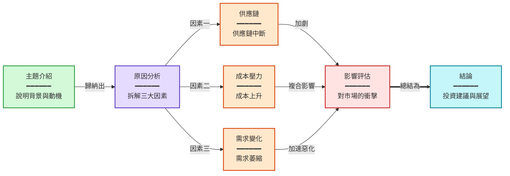
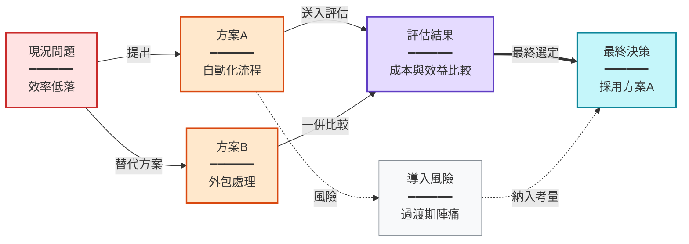

請根據以下影片摘要，用 Mermaid 流程圖呈現影片的敘事邏輯或核心概念的關係。
為摘要中適合視覺化的 #### 章節各產生一個圖表。

輸出格式：
每個圖表對應摘要中的一個 #### 章節。圖表標題必須與摘要中的 #### 標題完全一致（含 #### 前綴）。
如果某個章節不適合用流程圖表達，可以跳過該章節。
標題與 ```mermaid 之間不要有空行。

嚴格規則：
- 第一行必須是 graph 加方向：graph LR（左到右）或 graph TB（上到下），根據內容結構選擇合適的方向
- 節點文字格式：標題<br/>━━━━━━<br/>細節敘述，用 <br/>━━━━━━<br/> 換行
- 節點格式：大寫字母["標題<br/>━━━━━━<br/>細節"]，例如 A["開場<br/>━━━━━━<br/>介紹影片主題"]
- 連接格式：A --> B（主線）、A -.-> B（補充/可選）、A ==> B（強調）
- 每條箭頭都「必須」加上標籤，說明節點之間「為什麼」或「如何」連接：A -->|導致| B。不可有沒標籤的裸箭頭。例如：因果（導致、造成）、條件（若成功、若失敗）、方式（透過 API）、反饋（修正）。標籤控制在 2-6 字
- 每個圖表 5-12 個節點
- 根據內容的邏輯關係選擇合適的拓撲結構（分支、匯聚、並行、迴圈等），避免所有圖表都是單純的直線鏈
- 若內容為線性敘事且無法產生分支結構，應合併相關步驟到同一節點（用 <br/> 列舉），提高單節點資訊密度，將節點數控制在 3-6 個，避免長直線
- 用 ```mermaid 和 ``` 包裹
- 除了圖表標題外，不要輸出任何其他說明文字
- 在程式碼區塊末尾加上 style 宣告，為不同類型的節點上色

語法安全規則：
- 節點文字必須用雙引號包裹：["文字"]
- 節點文字中不可出現「數字. 空格」的格式（如 1. 步驟），改用「1.步驟」或「① 步驟」
- 節點文字中不可使用 emoji
- 節點文字中避免使用半形引號或括號，改用『』和「」
- 每個節點的標題控制在 20 字以內，細節控制在 80 字以內（合併步驟時可用 <br/> 分行列舉）

色彩指引（依語意選用）：
- 綠色 fill:#d3f9d8,stroke:#2f9e44 — 開場、輸入、起始
- 紅色 fill:#ffe3e3,stroke:#c92a2a — 問題、決策、衝突
- 紫色 fill:#e5dbff,stroke:#5f3dc4 — 分析、推理、核心論述
- 橘色 fill:#ffe8cc,stroke:#d9480f — 行動、方法、工具
- 青色 fill:#c5f6fa,stroke:#0c8599 — 結果、結論、產出
- 黃色 fill:#fff4e6,stroke:#e67700 — 數據、記憶、資料
- 灰色 fill:#f8f9fa,stroke:#868e96 — 背景、脈絡、補充

範例輸出：
#### 影片整體敘事流程


#### 解決方案的比較與選擇


摘要：
{{summary}}